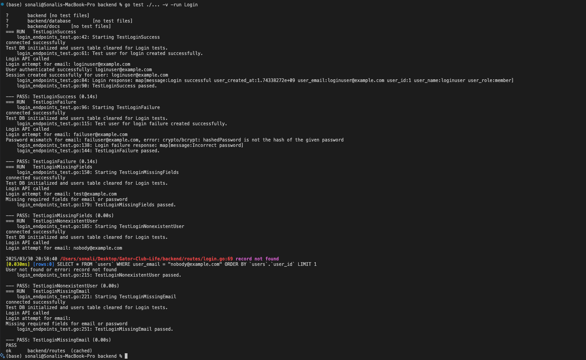
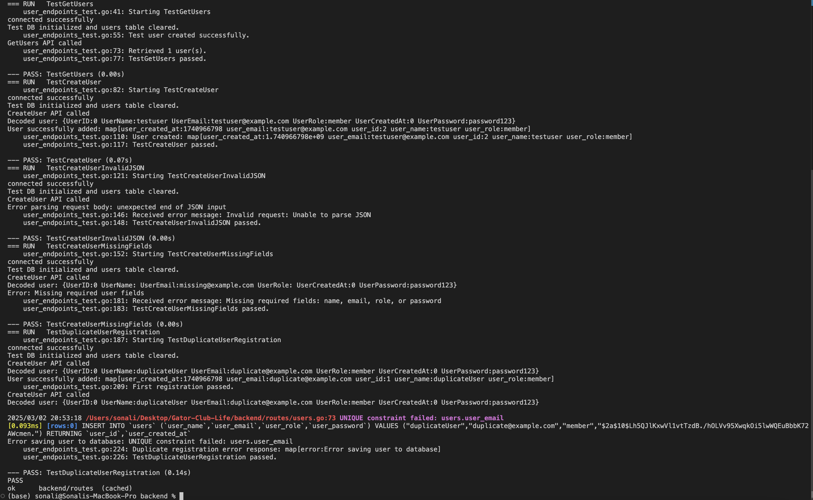

# Sprint 2 Report

**Project:** Gator-Club-Life 

**Frontend Team:** Abhigna Nimmagadda, Deekshita Kommi

**Backend Team:** Sri Ashritha Appalchity, Sonali Karneedi

### Videos
[Frontend and Backend](https://drive.google.com/drive/folders/1kkT7gbNt4uXTScHYFuFIJxnzco7gSksB?usp=drive_link)

---

## 1. Implemented Secure Login Functionality

- **Database Update:**
  - Added a new password attribute to the users table.
- **User Registration API Update:**
  - Modified the registration endpoint to accept and securely store (hashed) passwords.
- **Login API Endpoint:**
  - Developed a new login endpoint to authenticate users, ensuring error responses are returned as JSON.

---

## 2. Migrated Backend from net/http to Fiber Framework

- Replaced Go’s built-in HTTP router with the Fiber framework.
- Rewrote endpoint handlers to use Fiber’s context for improved performance and maintainability.

---

## 3. Integrated Swagger for API Documentation

- Added Swagger annotations to backend endpoints.
- Configured the Fiber server to serve Swagger UI on `/swagger`, providing interactive API documentation.

---

## 4. Integrated Front-End & Back-End Login Functionality

- **Backend Adjustments:**
  - Configured the Fiber backend to support CORS for cross-origin requests.
  - Ensured the Login API endpoint is secure and returns consistent JSON responses.
- **Front-End Integration:**
  - Updated the Angular login component to call the Fiber Login API endpoint.
  - Integrated error handling and routing so that a successful login redirects the user to the home page.

---

## 5. Integrated Front-End & Back-End Register Functionality

- **Backend Adjustments:**
  - Updated the registration (CreateUser) API endpoint to handle password storage and return a clean response (omitting the password).
  - Enabled CORS on the backend to allow the Angular registration component to interact seamlessly.
- **Front-End Integration:**
  - Updated the Angular registration component to send a registration request to the backend.
  - Implemented proper validation (e.g., password confirmation) and error display in the front-end.

---

## 6. Backend Unit Tests for API Endpoints

- **Unit Tests for Users API Endpoints:**
  - Developed tests for fetching users, creating users (including handling invalid JSON, missing fields, and duplicate registration).
- **Unit Tests for Login API Endpoints:**
  - Developed tests for successful login, login failure (invalid credentials), and login with missing fields.
- **Test Structure:**
  - Tests were structured to maintain a 1:1 mapping with endpoint functions, ensuring comprehensive coverage.

---
## Unit Test Case Results:

### BACKEND
- Login API Unit Test Results

- Users API Unit Test Results

# Frontend Documentation for Sprint

## Overview

During this sprint, we have made significant progress in the frontend development of our application. The primary focus was on implementing the *Registration Component, **Organization Page, **API Integrations, and **Automated Testing* using Jasmine and Karma for Unit Testing.

## Features Implemented

### 1. Registration Component

•⁠  ⁠Developed the *Registration Component* where users can create their accounts.
•⁠  ⁠Linked the *Registration Page* to the *Login Page* for seamless user experience.
•⁠  ⁠Form fields include:
  - Name
  - Email
  - Username
  - Password
  - Confirm Password
  - Role (Dropdown with options like *Member*)
•⁠  ⁠Successful registration redirects users to the *Login Page*.
•⁠  ⁠Minimum password length validation will be added in the next sprint.
•⁠  ⁠Username availability check will be implemented in the next sprint.

### 2. Organization Page

•⁠  ⁠Created the *Organizations Page* to display a list of clubs that users can browse through.
•⁠  ⁠Displayed club details in a structured layout and added a filter search.

## API Integrations

We have integrated the following API endpoints:

| Page         | Endpoint         | Method |
| ------------ | ---------------- | ------ |
| Registration | ⁠ /users/create ⁠  | POST   |
| Login        | ⁠ /login ⁠         | POST   |

### API Integration Flow

•⁠  ⁠Registration: Submits user data to the backend and handles success or error responses.
•⁠  ⁠Login: Authenticates users and stores the *isLoggedIn* status in localStorage.

## Cypress Testing

We implemented *End-to-End Testing* using Cypress to ensure the functionality of our key components.

### Cypress Test Cases

#### Authentication Tests

•⁠  ⁠Successful Registration
•⁠  ⁠Login with Valid Credentials
•⁠  ⁠Login with Invalid Credentials
•⁠  ⁠Navigation to About Page after Login

#### Code Reference

Refer to the following Cypress test files:

•⁠  ⁠⁠ cypress/e2e/spec.cy.ts ⁠
•⁠  ⁠⁠ cypress/e2e/register_spec.cy.ts ⁠

### Key Assertions

•⁠  ⁠Successful registration redirects to */login*.
•⁠  ⁠Invalid credentials display appropriate error messages.
•⁠  ⁠Valid login credentials redirect to */home*.
•⁠  ⁠Navigation to the *About Page* works correctly after login.

## Testing

In addition to the development of the core features, we performed unit testing for various components to ensure they function correctly in isolation.

### Unit Testing:
- **Utility Functions**: Verified that utility functions are correctly manipulating data.
- **Form Validation**: Tested the registration form to ensure fields are validated properly.
- **Mocked API Calls**: Mocked the API service calls to test component behavior without depending on the backend.

### Tools Used:
- **Jasmine and Karma**: Used for unit testing.
- **Cypress**: For end-to-end testing.
- **Karma**: Test runner for executing unit tests across different browsers.

### Test Cases:
1. Form validation for empty fields.
2. Email format validation.
3. Password mismatch validation.
4. Mocked API service calls to ensure correct data submission and response handling.
5. Utility function tests for correct data manipulation and error handling.

### Test Results:
- **12 test cases** passed successfully.
- Here is the screenshot of the test results:

## Next Steps

- **UI/UX Enhancements**: Improve the design of the Organizations Page.
- **Add Additional Pages**:
  - **Event Page**: A page dedicated to upcoming events hosted by the organization.
  - **Dashboard**: A personalized dashboard for users to track their activities and interests.
  - **Student Profile Page**: A page where users can manage and update their profiles.
- **Input Validation for Registration Form**: Further improve the input validation, especially for complex data fields.

## Conclusion

With the addition of the Registration Component, Organizations Page, and API integrations, along with comprehensive unit testing, we have ensured that the frontend meets the functional requirements of this sprint. The passed test cases guarantee the stability and reliability of our codebase, enabling us to confidently move forward with additional features in the next sprint.
