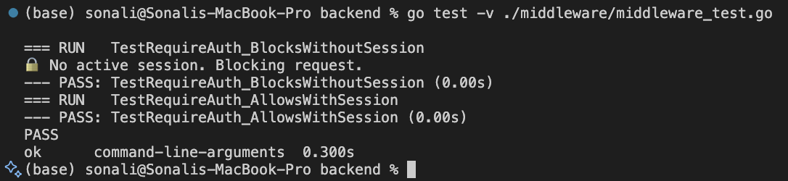
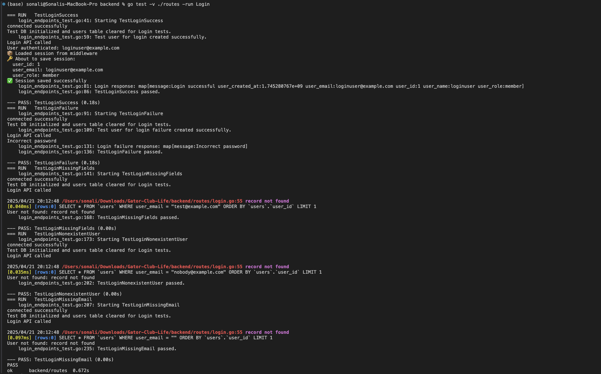
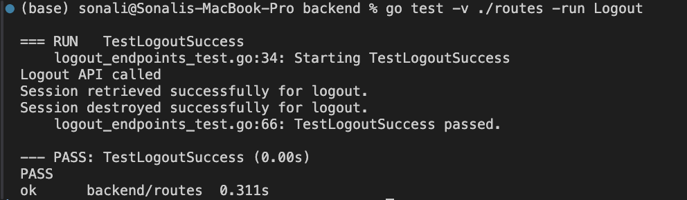
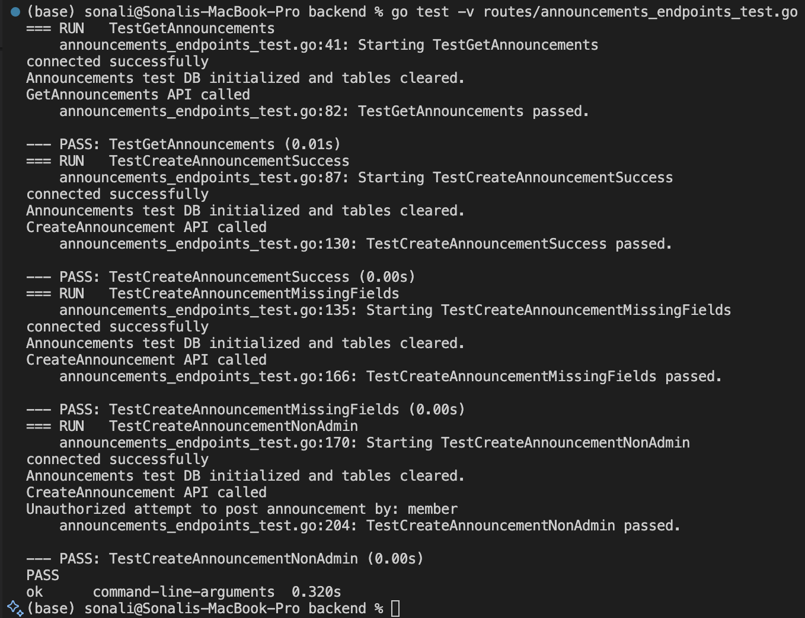
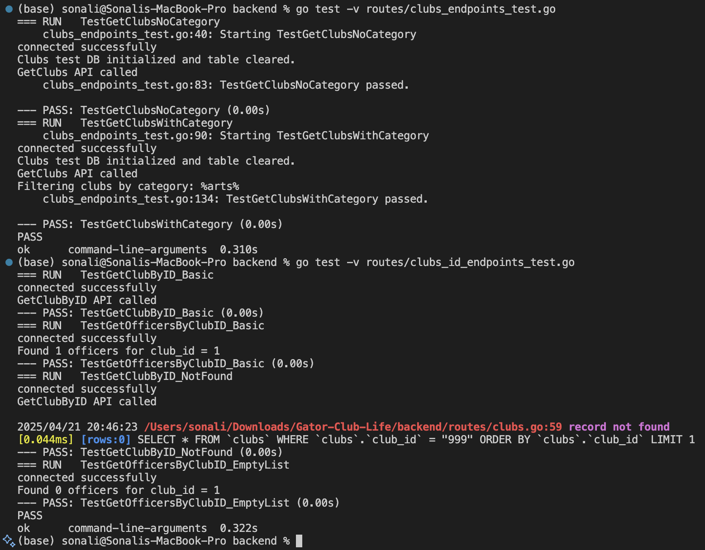
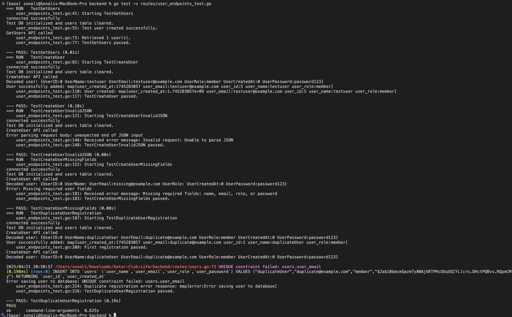

# Sprint 4 Report

**Project:** Gator-Club-Life 

**Frontend Team:** Abhigna Nimmagadda, Deekshita Kommi  
**Backend Team:** Sri Ashritha Appalchity, Sonali Karneedi

### Videos
[Frontend and Backend](https://drive.google.com/drive/folders/1Z7viHAD-hF8E0bMIbDpN7FGg0BqeDwxI?usp=sharing)

# Backend Documentation for Sprint 4

## Authentication & Session Management
- Implemented secure session destruction on backend restart to prevent stale session reuse.
- Ensured session persistence across server restarts using `fiber/session`.
- Extended login middleware to automatically associate `SubmittedBy` using active session data.
- Added full logout functionality to safely destroy sessions.
- Fully tested authentication flows with valid and invalid input cases.

## Event Permit Submission System
- Designed and implemented the full backend pipeline for event permit processing:
  - Defined comprehensive database schema for event permits, including nested slots and documents.
  - Built a single `/event-permits/submit` POST endpoint that accepts and stores full submission payloads.
  - Linked frontend to backend to ensure data flow from UI to database is seamless.
  - Connected user session data to submission payloads to track who submitted each permit.

## My Submissions Feature
- Added a new `MySubmissions` table to store user-specific submission data.
- Created APIs to retrieve submissions filtered by the authenticated user’s email.
- Connected frontend dashboard to display a logged-in user’s personal submissions dynamically.
- Ensured all submission tracking and filtering logic reflects the real-time database state.

## Organizations & Clubs Enhancements
- Built endpoints to:
  - Fetch a single organization by its ID.
  - Retrieve officers associated with a specific club.
- Integrated backend with the frontend to support dynamic organization detail pages.
- Improved announcement and club retrieval APIs with category and ID-based filtering.

## Announcements System Improvements
- Enhanced announcement APIs to:
  - Support admin-only creation via POST.
  - Filter announcements by club ID for better personalization.
- Connected frontend display logic with backend filters for real-time data updates.

## Sprint 4: Backend Unit Testing

### Goals of Sprint 4 Testing
The primary goal of unit testing in Sprint 4 was to:
- Ensure reliability and correctness of newly implemented backend features.
- Validate security and access control, especially around authentication and session-based data access.
- Detect and handle edge cases and error flows early.
- Build a scalable test foundation for future sprints with reusable utilities and seeded data.

### Test Structure & Strategy
All tests were organized into the following categories:
1. Middleware Tests – Validate access control logic.
2. Authentication Tests – Cover login and logout flows.
3. Event Permit Tests – Ensure correct storage, retrieval, and filtering.
4. Announcements Tests – Enforce role-based creation and validate filtering.
5. Clubs & Organizations Tests – Ensure accurate querying by ID or category.
6. User API Tests – Cover registration, validation, and duplication errors.

### Middleware Testing
- `TestRequireAuth_BlocksWithoutSession`  
  Confirms unauthorized access is blocked without a session.
- `TestRequireAuth_AllowsWithSession`  
  Grants access to authenticated users with valid sessions.

### Login & Logout API Testing
- `TestLoginSuccess` – Valid login with correct credentials.
- `TestLoginFailure` – Handles incorrect password.
- `TestLoginMissingFields` – Missing `email` or `password`.
- `TestLoginNonexistentUser` – User doesn't exist.
- `TestLoginMissingEmail` – Missing `email` field.
- `TestLogoutSuccess` – Confirms session destruction on logout.

### Event Permits Testing
- `TestSubmitFullEventPermit_DBLogic` – Validates full DB persistence.
- `TestSubmitFullEventPermit_Endpoint` – Endpoint request to DB response.
- `TestGetUserSubmissions_FilteredByEmail` – Retrieves session-specific submissions.

### Announcements Testing
- `TestGetAnnouncements` – Fetch all announcements.
- `TestCreateAnnouncementSuccess` – Admin-only creation.
- `TestCreateAnnouncementMissingFields` – Incomplete data triggers errors.
- `TestCreateAnnouncementNonAdmin` – Non-admin creation is blocked.

### Clubs Testing
- `TestGetClubsNoCategory` – No filter applied.
- `TestGetClubsWithCategory` – Valid category filter.
- `TestGetClubByID_Basic` – Valid ID retrieval.
- `TestGetClubByID_NotFound` – Invalid ID returns 404.
- `TestGetOfficersByClubID_Basic` – Retrieve officer list.
- `TestGetOfficersByClubID_EmptyList` – Handle no officers case.

### Users API Testing
- `TestGetUsers` – Fetch all users.
- `TestCreateUser` – Valid new user registration.
- `TestCreateUserInvalidJSON` – Handles malformed request.
- `TestCreateUserMissingFields` – Missing required fields.
- `TestDuplicateUserRegistration` – Prevents duplicates.

## Frontend Development Overview

### 1. Permits Workflow (End-to-End Implementation)
- Developed a complete multi-step Permits workflow:
  - Step 1: Basic Information – Captures core event details.
  - Step 2: Event Dates – Calendar integration with FullCalendar.
  - Step 3: Additional Forms – File upload and notes support.
  - Step 4: Final Review – Consolidated permit summary view.
- Integrated EventPermitService for shared state across steps.
- Added sidebar UI to visually track user progress.

### 2. Organizations Page
- Built a fully functional Organizations listing page.
- Features:
  - Dynamic search bar (by name, location, or keywords).
  - Sidebar category filters for streamlined browsing.
  - Interactive cards with routing to organization detail view.
- Applied responsive design using TailwindCSS utilities.

### 3. Organization Details Page
- Dynamically loads organization data using route parameters.
- Fetches and displays:
  - Officer/Advisor data.
  - Purpose section.
  - Linked announcements and upcoming events.
- Modular layout with sidebar and content zones.

### 4. My Submissions Component
- Structured into three tabs: My Permits, Org. Registrations, and Applications.
- After discussion we decided to only have My Permits and removed the remaining tabs.
- Built My Permits section with:
  - Search and filter functionality.
  - Status chips for Completed, Pending, and Denied permits.
  - Clean table layout to view past submissions.

### 5. My Events Component
- Developed an interactive view showing a user’s saved or RSVP'd events.
- Included:
  - Filter by category.
  - Search by event name.
  - Favorite toggling.

### 6. Login Workflow Debugging
- Resolved login-related Cypress testing bugs:
  - Fixed routing issues during Cypress test login.
  - Ensured proper form submission triggers via button selectors.
- Skipped login in specific tests by intercepting login routes where needed.

---

### 7. Registration and Authentication Enhancements

- **UF Email Restriction**:  
  User registration is now restricted to `@ufl.edu` domains, ensuring only University of Florida students can register.

- **Password Visibility Toggle**:  
  Implemented show/hide buttons for both password and confirm-password fields to improve user accessibility during signup.

- **Password Strength Meter**:  
  A live visual indicator of password strength (Weak, Moderate, Strong) was added to encourage stronger security practices.

- **Username and Email Availability Checks**:  
  Real-time validation was added from the frontend to check for existing usernames and emails before form submission.

---

### 8. Admin Role Support and Dashboard

- **Role Selection During Registration**:  
  Users now choose their role (either `admin` or `member`) at the time of registration.

- **Role-Based Login Redirection**:  
  After successful login:
  - Members are redirected to the Home page.
  - Admins are redirected to a dedicated Admin Dashboard.

- **Admin Dashboard**:  
  - Accessible only to users with the `admin` role.
  - Hidden from regular users (members).
  - Includes basic features like managing users, viewing events, and posting announcements.

---

### 9. Event Details and RSVP Functionality

- **Learn More Modal for Events**:  
  Users can now view detailed information for each event in a modal, improving the user experience without leaving the page.

- **RSVP and Undo RSVP Support**:  
  Users can RSVP for an event and undo it later if needed. These actions update instantly and are backed by real-time UI changes.

---

### 10. Website UI Styling

- General UI improvements were made across all components for a cleaner, more responsive, and intuitive design.
- The homepage, event listings, registration and admin pages were restyled and optimized.

---

## Testing Accomplishments

### Unit Testing (25 Test Cases)
All unit tests were executed using Jasmine + Karma, with zero failures.  

**Highlights:**
- Login Error Handling  
- Sidebar Dropdown (Click, MouseLeave, Toggle)
- Organization Cards Filtering  
- Permit Navigation Logic  
- Dynamic Page Load for Org Details

**Unit Test Coverage Snapshot:**

| Component | Test Cases |
|-----------|------------|
| OrganizationsComponent | should create |
| EventsComponent | create, search, category filtering |
| PermitsComponent | should create |
| LoginComponent | error handling, validation |
| AppComponent (Dropdown) | toggle, click outside, render |
| MySubmissionsComponent | should create |
| MyProfileComponent | editable phone, toggle edit |
| AuthGuard, AuthService | creation, guards |
| OrganizationDetailsComponent | dynamic data test |
| AnnouncementsComponent | structure, data render |

**Total Unit Tests:** 25  
**Failures:** 0  
**Screenshot:** 

### Cypress End-to-End Testing

- Wrote full E2E Cypress workflows for:

- Used `cy.intercept()` and dynamic assertions to mock APIs where applicable.

**Cypress Highlights:**
- `cy.get('button[type="submit"]')` for form auth.
- `.organization-card` load tests passed after adding `timeout`.

## Bugs Fixed / Issues Closed
- Login Submit Selector bug: corrected Cypress login trigger.
- Organization Filtering Cypress Error: fixed missing DOM issue.
- Mouseleave on Dropdown: dropdown would disappear prematurely.
- Permit Sidebar Visibility: fixed render logic per step.
- Cypress Timeout & Test Detection: resolved no-tests-found issue.

## Overview of Work Completed

This sprint focused on improving the core user flows, role-based functionality, and event engagement capabilities of the GatorClubLife platform. 

## Conclusion
This final sprint encapsulated the complete end-to-end implementation of the Permits workflow, Organization discovery, user profile experience, and submission management. By ensuring robust Cypress automation and unit test coverage, the application has reached a feature-complete and test-validated state.
